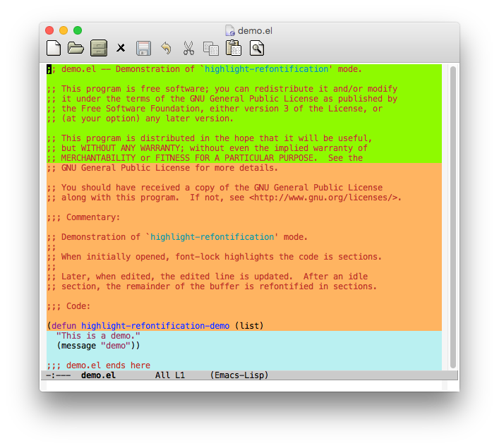

# highlight-refontification - Visualize font-lock refontification

*Author:* Anders Lindgren 
*Version:* 0.0.3 
*URL:* [https://github.com/Lindydancer/highlight-refontification](https://github.com/Lindydancer/highlight-refontification) 

Minor mode that visualizes how font-lock refontifies a buffer.
This is useful when developing or debugging font-lock keywords,
especially for keywords that span multiple lines.

The background of the buffer is painted in a rainbow of colors,
where each band in the rainbow represent a region of the buffer
that has been refontified.  When the buffer is modified, the
rainbow is updated.

## Screenshot

## Background

When you edit a file, font-lock mode recalculates syntax
highlighting as you type.  Clearly, this process must be fast.  If
not, Emacs would appear to be slow.  For this reason, as little as
possible is refontified, often only the line that was edited.  Once
Emacs is idle, a larger section is refontified.

Unfortunately, some font-lock keywords doesn't work correctly when
applied to region which is too small.

## Examples

You can use this tool, for example, to:

- Investigate when font-lock makes Emacs slow.  If a large region is
  refontified for every character typed, could cause this.
- Investigate why a font-lock rule sometimes work, sometimes
  doesn't.  One cause of this could be that the region starts in
  the middle of the language construct that should be highlighted.
- Investigate "blinking" syntax highlighting, i.e. the effect where
  one color is first applied, and after, say, half a second,
  another is applied.

## The refontification process

When font-lock decides to update a region, it calls the functions
in `font-lock-extend-region-functions`.  Each function can extend
the region.  For example, when `font-lock-multiline` is enabled,
the function `font-lock-extend-region-multiline` is included.  It
will extend the region to include all the lines of something that
previously was matched in a multiline rule.

## Usage

- <kbd>M-x highlight-refontification-mode RET</kbd> -- When this mode is
  enabled, any change in the buffer is visualized by a change in
  the background color.
- <kbd>M-x highlight-refontification-list-extend-region-steps RET</kbd> --
  Print the steps font-lock would take to extend a region.

## Other Font Lock Tools

This package is part of a suite of font-lock tools.  The other
tools in the suite are:

### [Font Lock Studio](https://github.com/Lindydancer/font-lock-studio)

Interactive debugger for font-lock keywords (Emacs syntax
highlighting rules).

Font Lock Studio lets you *single-step* Font Lock keywords --
matchers, highlights, and anchored rules, so that you can see what
happens when a buffer is fontified.  You can set *breakpoints* on or
inside rules and *run* until one has been hit.  When inside a rule,
matches are *visualized* using a palette of background colors.  The
*explainer* can describe a rule in plain-text English.  Tight
integration with *Edebug* allows you to step into Lisp expressions
that are part of the Font Lock keywords.

### [Font Lock Profiler](https://github.com/Lindydancer/font-lock-profiler)

A profiler for font-lock keywords.  This package measures time and
counts the number of times each part of a font-lock keyword is
used.  For matchers, it counts the total number and the number of
successful matches.

The result is presented in table that can be sorted by count or
time.  The table can be expanded to include each part of the
font-lock keyword.

In addition, this package can generate a log of all font-lock
events.  This can be used to verify font-lock implementations,
concretely, this is used for back-to-back tests of the real
font-lock engine and Font Lock Studio, an interactive debugger for
font-lock keywords.

### [Faceup](https://github.com/Lindydancer/faceup)

Emacs is capable of highlighting buffers based on language-specific
`font-lock` rules.  This package makes it possible to perform
regression test for packages that provide font-lock rules.

The underlying idea is to convert text with highlights ("faces")
into a plain text representation using the Faceup markup
language.  This language is semi-human readable, for example:

    «k:this» is a keyword

By comparing the current highlight with a highlight performed with
stable versions of a package, it's possible to automatically find
problems that otherwise would have been hard to spot.

This package is designed to be used in conjunction with Ert, the
standard Emacs regression test system.

The Faceup markup language is a generic markup language, regression
testing is merely one way to use it.

### [Font Lock Regression Suite](https://github.com/Lindydancer/font-lock-regression-suite)

A collection of example source files for a large number of
programming languages, with ERT tests to ensure that syntax
highlighting does not accidentally change.

For each source file, font-lock reference files are provided for
various Emacs versions.  The reference files contains a plain-text
representation of source file with syntax highlighting, using the
format "faceup".

Of course, the collection source file can be used for other kinds
of testing, not limited to font-lock regression testing.

---
Converted from `highlight-refontification.el` by [*el2markdown*](https://github.com/Lindydancer/el2markdown).
